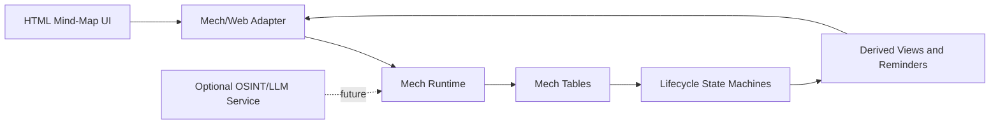

# People Relationship Manager

A Mech-based personal relationship management system for modeling people, attributes, addresses, interactions, and relationship state as reactive data.

New to this code? Start with the [Mech and MCFG tutorial](docs/MECH-TUTORIAL.md) and its [small runnable attribute-join example](examples/attribute-join.mec).

This is an approved public source snapshot. It includes the working local app, interactive map, startup launcher, tutorial, and ten fictional examples. Development history, personal working databases, exports, and backups are not included.

The tracked demo contains **10 fictional people**, with 20 attribute assignments and 12 connections. Their biographies and locations are invented; no real birthdays are included. The server initializes an untracked `people.mcfg` from `examples/people.example.mcfg` on first launch. Existing local databases are never replaced automatically, and personal edits are not committed.

## What works now

- Interactive relationship map: pan, drag nodes, zoom, expand, fit, and name search.
- Editable profiles, shared attributes, connections, interactions, and lifecycle actions.
- Local MCFG database with automatic backups and Mech-calculated views.
- Portable MCFG import/export and a Windows startup launcher.

Start with [Run the working app](#run-the-working-app), explore the [fictional demo](#fictional-demo), or learn the data model in the [Mech tutorial](docs/MECH-TUTORIAL.md).

## Run the working app

**Windows: double-click `start.cmd`.** It starts the backend and opens the correct browser address. Keep the launcher window open while using the app; closing it stops the backend. If the app is already running, the launcher reuses it. Do not open `index.html` directly or use a static/Live Server preview: those cannot save data or execute Mech.

In this project folder, with Node.js (18 or newer) and your v0.4-beta Mech build installed:

```powershell
node server.cjs
```

Open **http://127.0.0.1:8080**. Keep that terminal open; stop with `Ctrl+C`.
No npm installation, manual export, or separate build is needed for normal use.

- Form submissions, attribute assignments, connections, and lifecycle buttons now update the actual `people.mcfg` file.
- Mech calculates latest contact, current address, elapsed days, contact status, and the person/attribute join on every load and save.
- **Reload database** reads disk again and recalculates Mech results. Use it after hand-editing the file or when the date changes; it does not reset your records.
- Wait for **saved to people.mcfg** before closing the app. A failed calculation does not commit a new file.
- Each successful save first backs up the old file under `.backups/people.mcfg/`. Exports remain useful as portable copies.

This is a local, single-user app, not an internet-ready service. Do not expose its port publicly.

### Navigate the people map

- Drag the background to pan, or drag individual people to arrange them. Connections follow their endpoints.
- Use the mouse wheel, trackpad, touch pinch, or **+/−** buttons to zoom. **Fit all** brings the whole network back into view.
- **Expand map** gives the network the full workspace width, with the editing panel below. Collapse restores the side-by-side layout.
- Type a name in **Find a person**, then choose a result (or press Enter for the first match). The map centers and zooms to that person and opens their profile. Results show IDs to distinguish duplicate names.
- **Find selected** returns to the selected person. **Rearrange** resets positions to a spaced, connection-ordered layout without overlapping cards.
- Keyboard: focus the map and use arrow keys to pan, **+/−** to zoom, and **F** to fit. Search results support arrow keys and Enter; nodes are also reachable with Tab.

Map positions and zoom are temporary presentation state: they survive profile edits and database reloads within the page, but reset when the page is refreshed. Moving nodes never changes person records or relationships. Newly added people can be found with **Find selected** or **Fit all**.

### Fictional demo

| ID | Name | Example role |
| --- | --- | --- |
| 1 | Mira Vale | Interface designer |
| 2 | Jonah Reed | Software developer |
| 3 | Sana Brooks | Workshop organizer |
| 4 | Theo Hart | Technical writer (archived) |
| 5 | Elena Moss | Visualization researcher |
| 6 | Rowan Pike | Accessibility reviewer |
| 7 | Nadia Finch | Workshop facilitator |
| 8 | Felix Wren | Atlas developer |
| 9 | Iris Quinn | Project coordinator (archived) |
| 10 | Owen Alder | Visualization student |

All 10 profiles are connected into one example network. They share catalog attributes through ID links rather than duplicate attribute records. Contact-health labels vary with the current UTC date; Elena and Owen demonstrate missing contact history.

Already have a local database? Updating the code does **not** replace it with these examples. To preview the new demo safely in PowerShell, run a separate instance:

```powershell
New-Item -ItemType Directory -Force .generated | Out-Null
$demo = Join-Path (Resolve-Path .generated).Path ("demo-" + [guid]::NewGuid() + ".mcfg")
Copy-Item examples/people.example.mcfg $demo
$env:PRM_DATABASE = $demo
$env:PORT = '8081'
node server.cjs
```

Open `http://127.0.0.1:8081`. Use a new terminal for the normal app afterward, so it does not inherit these demo environment variables.

This project starts from a simple idea: personal and professional networks are dynamic, but most tools treat them like static notes. People move, preferences change, contact goes stale, and relationships need different kinds of attention over time. The goal is to build a small, understandable CRM that uses [Mech](https://github.com/mech-lang) - a language for data-driven, reactive systems - as the database and behavior layer.

## Project Vision

People Relationship Manager is a research-oriented personal CRM that explores how data-oriented programming can represent human relationship data.

The first version focuses on a local, manually edited data core:

- Store structured information about people, including names, background, status, birthdays, attributes, and addresses.
- Track historical changes such as address updates and, later, interactions.
- Use Mech tables as the source of truth.
- Use state-machine logic to transition contacts between states such as `:active`, `:needs-catchup`, and `:archived`.
- Build a browser UI that feels like a mind map, making the relationship graph easy to view and edit.

Longer term, the project may experiment with optional external services that collect public updates, extract structured facts, and stream them into the Mech runtime.

## Why Mech?

Mech is designed for data-driven, reactive systems: programs begin with data, describe how that data relates, and automatically update dependent values when the underlying data changes.

That makes it a good research fit for this project because a relationship manager is fundamentally a living graph of changing facts:

- A birthday can trigger a reminder.
- A new interaction can refresh a relationship status.
- A new address can update the visible contact profile.
- A new attribute can change search, grouping, or recommendations.
- A state machine can make contact lifecycle rules explicit instead of hiding them in UI code.

## Current Repository

```text
.
+-- person.mec   # Mech schema, join, and contact-health functions
+-- people.mcfg  # Local working records (Git-ignored)
+-- examples/people.example.mcfg # Ten fictional profiles for clean installations
+-- database.js  # MCFG reader/writer, validation, and table conversion
+-- tools/build-mech.cjs # Build a Mech program from the stored records
+-- tools/mech-engine.cjs # Run Mech and decode website views
+-- server.cjs   # Local API, disk saves, backups, and static website
+-- examples/attribute-join.mec # Standalone learning example
+-- docs/MECH-TUTORIAL.md # Syntax, data flow, joins, and exercises
+-- index.html   # Browser workspace
+-- app.js       # Browser data and UI logic
+-- network-map.js # Interactive graph, layout, and search
+-- README.md    # Project overview and roadmap
+-- LICENSE
```

The current `person.mec` file defines the database structure with:

- `person`: stable person identity, lifecycle status, birthday, and background.
- `attribute`: reusable typed facts such as major, school, degree, language, habits, food preferences, and MBTI.
- `person-attribute`: links people to reusable attributes.
- `address-log`: timestamped address history for each person.
- `interaction-log`: timestamped contact events such as meetings, messages, calls, and notes.
- `relationship`: graph edges between people for the future mind-map UI.
- `lifecycle-policy`: starter thresholds for contact lifecycle states.
- `lifecycle-transition`: allowed state changes for manual lifecycle events.
- `lifecycle-event`: schema for recorded `contacted`, `reconnected`, and other user actions.
- `lifecycle-state`: metadata describing a planned state-machine view.

`person.mec` describes these tables in `schema-table`, `schema-field`, and `schema-rule` metadata and defines the joined attribute view. All records live in `people.mcfg`. The browser adapter validates field types, unique keys, and references before accepting data; the schema metadata by itself does not enforce database constraints in Mech.

The browser workspace uses:

- `index.html`: page structure and accessible regions.
- `styles.css`: responsive mind-map layout and visual styling.
- `app.js`: forms and requests to the local API.
- `network-map.js`: interactive graph, layout, name search, and camera controls (no external dependencies).
- `database.js`: a shared browser/Node adapter for the application's static MCFG data format.
- `people.mcfg`: editable records, ID links, histories, lifecycle policies, and runtime settings.

The local server reads and writes `people.mcfg`; browser storage is no longer the source of truth. **Import data** accepts MCFG exports and older JSON backups, asks before replacing the database, and makes a server-side backup. If an old browser save exists at the current address, **Import old browser save** offers an explicit migration. Browser saves at a different host/port must be exported from the old page and imported here; they are never silently merged.

The UI provides attribute search and Category/Value suggestions, prevents duplicate assignments, and supports adding connections between people. It also supports profile editing, interaction recording, and archiving or reconnecting a person. Attribute source/confidence, interaction follow-up dates, address history, and lifecycle policies are retained when exporting and importing.

## MCFG Storage and Attribute Joins

This implementation follows the [configuration examples](https://github.com/mech-lang/mech/tree/codex/v0.4-consolidation-head-hygiene/examples) and [config schema](https://github.com/mech-lang/mech/blob/codex/v0.4-consolidation-head-hygiene/docs/reference/config/schema.mec) on the requested branch. The [config compiler](https://github.com/mech-lang/mech/blob/codex/v0.4-consolidation-head-hygiene/src/runtime/src/config/profile/compile.rs) accepts static records and lists but explicitly rejects table literals. Arbitrary fields inside the runtime `config` record are also rejected. Therefore this app stores two top-level bindings in one file:

- `database := {...}` contains all application records as lists of records.
- `config := {...}` contains the supported runtime settings and generated program path.

The `database` binding is our application's storage convention. Mech's configuration loader does not automatically expose it as program tables. `node tools/build-mech.cjs` reads it, validates it, creates typed tables, and appends `person.mec` into `.generated/people-runtime.mec`. This generated file can be deleted and rebuilt; edit `people.mcfg` to change the stored data.

For example, these records inside `database` connect two people to the same reusable attribute:

```mech
attribute: [
  { attribute-id: 4 category: "language" value: "English" }
]
person-attribute: [
  { person-id: 1 attribute-id: 4 source: "manual" confidence: 1.0 }
  { person-id: 2 attribute-id: 4 source: "manual" confidence: 1.0 }
]
```

The key for an assignment is the pair `(person-id, attribute-id)`. Adding a different pair assigns an existing attribute without copying its text. Removing a pair unassigns it from that person while keeping the shared attribute. Both referenced IDs must exist, and duplicate pairs are rejected.

`person.mec` combines the tables with Mech's [natural join operator](https://github.com/mech-lang/mech/blob/codex/v0.4-consolidation-head-hygiene/docs/reference/table.mec):

```mech
person-attribute-details := person ⋈ person-attribute ⋈ attribute
```

The first join matches `person-id`; the second matches `attribute-id`. The resulting view contains the person profile, link metadata, category, and value. Keep unrelated column names distinct because natural joins match **all shared column names**. People without attributes remain in `person` and the browser graph; an inner join omits them from this particular view.

The app's MCFG reader supports static records, lists, double-quoted strings with escapes, nonnegative numbers, booleans, and `--` comments. It rejects executable expressions and unsupported bindings instead of evaluating Mech code in the browser. IDs are validated as unsigned integers and emitted as `u64` in generated tables. Browser IDs currently stop at `Number.MAX_SAFE_INTEGER` (9,007,199,254,740,991); larger values are rejected to prevent rounding.

## Planned Data Model

The current model should grow in small steps. A practical near-term schema could be:

| Table | Purpose |
| --- | --- |
| `person` | Stable identity and profile summary for each person. |
| `attribute` | Reusable facts about people, grouped by category. |
| `person-attribute` | Join table connecting people to attributes. |
| `address-log` | Historical address records with timestamps. |
| `interaction-log` | Calls, messages, meetings, emails, and notes over time. |
| `relationship` | Edges between people, with relationship type and strength. |
| `lifecycle-transition` | Allowed transitions for manual lifecycle events. |
| `lifecycle-event` | User-recorded events that cause a lifecycle transition. |
| `lifecycle-state` | Current lifecycle view and recommended next event. |
| `reminder` | Derived or manually created follow-up tasks. |

The schema uses `person-attribute` as a many-to-many join table. Mech executes the natural join; the bridge returns the resulting ID pairs and resolves their display text from validated records.

The installed beta executable at `%USERPROFILE%/.cargo/bin/mech.exe` supports `--config` and `run`. It reports `Mech 0.3.6 (full)` because the checked v0.4-beta source still uses that package version; the version label alone is not a compatibility test.

Date math uses `date-day` values: integer day counts paired with readable ISO date strings. This allows simple subtraction such as `today-day - last-interaction.date-day`.

The website bridge reads a strictly checked numeric result table from Mech's CLI. An unexpected output format fails visibly instead of falling back to JavaScript calculations.

## Target Architecture



Recommended build order:

1. **Mech data core**: define stable tables for people, attributes, addresses, and interactions.
2. **Derived views**: compute current address, last interaction, days since contact, and relationship status.
3. **State machines**: transition contacts based on timestamps and explicit user actions.
4. **Persistence path**: decide how table state is saved and loaded during local development.
5. **HTML prototype**: render people and relationships as a simple graph/mind-map.
6. **Editing loop**: add UI controls that create or update Mech data.
7. **Optional automation**: experiment with public-data ingestion only after the manual workflow works.

## Milestone Plan

The original summer target was **August 24, 2026**. The current September integration prioritizes a complete manual editing loop over a large feature set.

### Data Foundation

- [x] Clean up `person.mec` into a documented schema.
- [x] Add `interaction-log`.
- [x] Add a small but realistic seed dataset.
- [x] Verify the file runs with the Mech CLI.

### Queries and Derived Views

- [x] Add `date-day` columns for simple date math.
- [x] Compute `days-since-contact`.
- [x] Compute catch-up and inactive boolean flags.
- [x] Add a `contact-health` derived view.
- [ ] Replace explicit current-address and last-interaction rollups with real group-by/max logic when Mech supports it.

### State Lifecycle

- [x] Convert status rules into a small Mech state-machine experiment.
- [x] Add manual events such as `contacted`, `archived`, and `reconnected`.
- [x] Keep the lifecycle small enough to explain in one diagram.

`lifecycle-transition` describes intended allowed changes, while `lifecycle-event` records what happened. The `lifecycle-state` entry remains schema metadata. Mech's `contact-status` function now uses the stored `active` and `needs-catchup` policy thresholds. The transition table is preserved but is not yet an enforced state-machine engine.

### Browser Prototype

- [x] Create a static HTML/CSS/JavaScript mind-map interface.
- [x] Render people as nodes and relationships as edges.
- [x] Show a side panel for person details.
- [x] Add an editable profile and interaction panel.

The browser now uses a local API, which runs a fresh Mech calculation before acknowledging each save.

### Editing and Persistence

- [x] Add forms for people, attributes, addresses, and interactions.
- [x] Assign reusable attributes without duplicate person links.
- [x] Connect a new person to existing people from the detail panel.
- [x] Connect UI edits to the Mech-backed data path.
- [x] Save and reload the actual MCFG file with backups and conflict detection.
- [x] Store all seed records in MCFG and add MCFG import/export.
- [x] Keep older JSON imports and explicitly import existing browser saves.
- [x] Generate typed Mech tables and an attribute join from MCFG records.
- [ ] Polish the demo flow.

### Final Buffer

- Write demo notes.
- Record known limitations.
- Prepare questions for future research work.

## Getting Started

Verify that Mech is available:

```powershell
mech --version
```

Build the Mech program from the database (requires Node.js):

```powershell
node tools/build-mech.cjs
```

Run the generated program with the checked local CLI:

```powershell
mech .generated/people-runtime.mec
```

Or run the standalone learning example:

```powershell
mech examples/attribute-join.mec
```

For a build whose help lists `--config` and `run`, the configuration-driven equivalent is:

```powershell
mech --config people.mcfg run
```

Rebuild after editing `people.mcfg` or `person.mec`. To inspect an exported database without replacing the project file, pass its path to `node tools/build-mech.cjs path/to/export.mcfg`. The builder uses a fixed local output path and does not execute imported configuration. Direct `.mec` execution does not apply `people.mcfg`'s runtime settings. `person.mec` expects the generated tables and is not a standalone seed program.

The generated seed program and its 10-row join run with the installed beta CLI. The local API also verifies calculations for empty contacts, empty assignments, custom policy thresholds, and archive overrides.

Start the working website with:

```powershell
node server.cjs
```

Then open `http://127.0.0.1:8080`. Select a person node to edit their profile, search and assign attributes, record interactions, and add connections. A static server such as `python -m http.server` no longer suffices: it cannot execute Mech or save the file.

The website requires a working Mech CLI. If Mech cannot be found, select it explicitly before starting the server:

```powershell
$env:MECH_BIN = Join-Path $env:USERPROFILE '.cargo\bin\mech.exe'
node server.cjs
```

Optional settings: `$env:PORT = '8082'` selects another port; `$env:PRM_DATABASE = 'C:\path\to\copy.mcfg'` selects a separate database for experiments. Settings apply only to the current terminal and its child processes. Restart the server after changing backend code.

### Save safety and recovery

The server validates data, obtains a file lock, checks the loaded file revision, runs Mech, backs up the previous file, and replaces the database with a flushed temporary file. Two tabs cannot silently overwrite each other's changes: the second receives a conflict and must reload. Avoid hand-editing the file while a save is underway.

On a failed or uncertain save, editing pauses. **Download unsaved draft** preserves the attempted changes when available; then **Reload database** to see what is actually on disk. A disconnected browser may not receive an acknowledgment even if the save completed, so reload before retrying.

For a malformed file, stop the server, keep a copy of the damaged file, restore a known-good `.mcfg` backup from `.backups/people.mcfg/`, and restart. If a crash leaves `people.mcfg.lock`, remove that lock file **only after stopping every server using this database**. Backups are not automatically pruned and are not encrypted; protect them like the original personal data.

### What Mech computes

- Latest interaction and address: largest `date-day`, then largest record ID for ties.
- Elapsed days: UTC calendar days, clamped to zero for future records.
- Contact status: archived overrides everything; no interaction means needs-catchup; otherwise use `active` and `needs-catchup` policy thresholds (inclusive upper bounds).
- Assigned attributes: the native `person ⋈ person-attribute ⋈ attribute` join.

Node supplies today's day number, typed data, and repeated query bindings; the selection, arithmetic, status decisions, and join execute in Mech. Node handles validation, persistence, and mapping returned IDs to text. JSON is used only for HTTP transport, never as the stored database.

This first bridge deliberately reruns Mech rather than keeping a reactive runtime alive. Large datasets may be slow: imports are capped at 1 MB, queries at 20,000 person/history comparisons, and each process at 30 seconds. The server uses its own trusted runtime configuration with a 25-second turn limit; imported `config` settings are preserved but never executed by the website. Future work includes a structured Mech output API, scalable grouped queries, enforced lifecycle transitions, reminders, and authentication before any hosted deployment.

If Windows cannot find `mech` after installation, restart the terminal or Codex app so the shell reloads `PATH`.


## Design Notes

- Keep IDs stable and boring. Use `PID`, `AID`, and later `IID` or `RID` consistently.
- Prefer ISO date strings like `YYYY-MM-DD` while prototyping because they are readable and sort naturally.
- Avoid over-normalizing early. A personal CRM benefits more from clear queries than from enterprise-style schema compression.
- Add one table only when a real query or UI behavior needs it.
- Treat the UI as a view over data, not the owner of the data.
- Keep future OSINT/LLM ingestion separate from the core app until manual editing is reliable.

## Current Working Slice

- Lifecycle policies, transitions, and events are stored alongside the other records in `people.mcfg`.
- `people.mcfg` stores all records and runtime configuration; `person.mec` holds schema metadata, the attribute join, and view functions.
- The browser now provides a local editable workflow with actual disk persistence and Mech-derived results.
- MCFG import/export preserves the database, and the Node adapter generates typed Mech tables for the v0.4 runtime.
- The manual end-to-end workflow is implemented; automated reminders and full lifecycle transition enforcement remain future work.

## Research Questions

- How naturally can Mech model relationship data as reactive tables?
- Are state machines a good fit for contact lifecycle management?
- What schema patterns make Mech code easiest to query and maintain?
- How should a graph-like UI map onto table-oriented data?
- What should remain manual for privacy and trust, even if automation becomes possible?

## License

This project is licensed under the terms in `LICENSE`.
