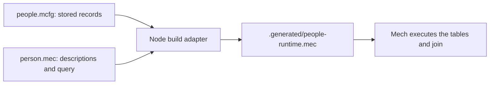

# Understanding the People Relationship Manager code

This tutorial explains how the project stores records in `people.mcfg`, turns them into Mech tables, and connects people to attributes using IDs. Start with the small example, then return to the full database. You do not need Rust experience to follow it.

To use the working website, run `node server.cjs` and open `http://127.0.0.1:8080`. The remaining commands are useful for studying the generated Mech code; they are not required before each website save.

## 1. Run the code first

Open PowerShell in the People-Relationship-manager folder:

```powershell
node tools/build-mech.cjs
mech .generated/people-runtime.mec
```

The first command reads the database and generates a Mech program. The second executes that program. With the supplied database, its final result has **10 rows**, one per person-to-attribute assignment.

You can also run the smaller example:

```powershell
mech examples/attribute-join.mec
```

It produces three rows:

| person-id | name | attribute-id | category | value |
| --- | --- | --- | --- | --- |
| 1 | Mira Vale | 4 | language | English |
| 1 | Mira Vale | 5 | language | Spanish |
| 2 | Jonah Reed | 4 | language | English |

The table above describes the expected result. The installed beta's table renderer now aligns numeric and text values correctly.

### Which Mech executable did we check?

The current `mech` command resolves to `%USERPROFILE%/.cargo/bin/mech.exe` and reports `Mech 0.3.6 (full)`. Your v0.4-beta source checkout still uses that package version. This build supports `--config`, `run`, the native join, and the functions used by the website bridge. Earlier notes about the old 0.3.5 build not supporting configuration no longer describe the installed executable.

To select your newly built executable explicitly:

```powershell
$mechExe = (Resolve-Path '../mechv0.4/mech/target/release/mech.exe').Path
& $mechExe --version
& $mechExe .generated/people-runtime.mec
```

PowerShell's `&` runs the executable stored in `$mechExe`. This avoids changing your system PATH. You can inspect command resolution with `Get-Command mech` and available features with `mech --help`.

## 2. Know which file to edit

Only the fictional `examples/people.example.mcfg` database is tracked. The server and default build command initialize a missing local `people.mcfg` from it, without overwriting an existing file. Your working records and backups stay outside Git; never force-add them to a commit.

| File | Role | When to edit it |
| --- | --- | --- |
| `people.mcfg` | All stored records, plus runtime settings | Add or change people, attributes, links, and histories |
| `person.mec` | Schema, attribute join, latest-record and contact-health functions | Describe a schema change or change calculation rules |
| `database.js` | Reads/writes MCFG, validates records, converts fields and types | Change the supported schema or file conversion |
| `tools/build-mech.cjs` | Builds the complete Mech program | Change the build workflow |
| `.generated/people-runtime.mec` | Generated tables followed by `person.mec` | Inspect it; rebuild instead of editing it |
| `tools/mech-engine.cjs` | Generates queries, executes Mech, decodes its results | Change the runtime bridge |
| `server.cjs` | Local API, file writes, conflict detection, backups | Change persistence or serving behavior |
| `app.js` | Browser forms, graph, and API requests | Change the website's behavior |

The command-line path is:



`person.mec` expects the data tables to exist already. Running it alone does not load `people.mcfg`. The builder places the tables before the query so the names can resolve.

## 3. Read the MCFG syntax

Here is an excerpt from `people.mcfg`. Keep the other lists in the real file; this excerpt alone is not a complete database:

```mech
database := {
  version: 1
  person: [
    {
      person-id: 1
      name: "Mira Vale"
      status: "active"
      birthdate: ""
      background: "Fictional interface designer at Example Studio"
    }
  ]
}
```

Read it from the outside inward:

1. `database := ...` defines a binding named `database`.
2. `{ ... }` groups named fields into a **record**.
3. `person: ...` gives that record a field named `person`. Here `:` separates a field name from its value.
4. `[ ... ]` is interpreted as a list by the configuration/data reader.
5. Each `{ person-id: ... }` inside that list is one person's record.
6. Double quotes mark text. `1` is a number; `"1"` is text.

`version: 1` is the **application's file-format version**, not the installed Mech version.

Names such as `person-id` use Mech's hyphenated identifier style. A person's ID is a stable identifier. It is not their position in the list, and changing their name does not require changing their ID.

The app supports a restricted static subset of MCFG: records, lists, strings with escapes, nonnegative numbers, booleans, and `--` line comments. Its JavaScript reader does not execute arbitrary Mech functions or expressions. For example, `name: "Mira Vale"` is supported; computing a name through a function call in this file is outside the reader's current capabilities.

### What does the config binding do?

The second top-level binding is:

```mech
config := {
  runtime: {
    name: "people-relationship-manager"
    limits: {
      max-turn-duration-ms: 2000
    }
  }
  run: {
    paths: [".generated/people-runtime.mec"]
    grants: []
  }
}
```

`runtime.name` labels the runtime. The duration limit configures the maximum runtime turn duration in milliseconds; it is not an autosave interval. `run.paths` identifies the generated program, relative to the configuration file's directory. `grants: []` requests no additional run grants for external host resources.

The requested configuration branch uses this form of command:

```powershell
mech --config people.mcfg run
```

The installed beta supports this command. The website uses a separate trusted, generated configuration with a 25-second turn limit, because generating all its derived views takes more time than the small join example. Imported `config` records are preserved as data; the server never executes their paths or host grants.

`database` is this application's storage convention. It is a separate top-level binding because the runtime's `config` record has a prescribed set of fields. Loading runtime configuration does not automatically create program tables from `database`. Our Node adapter performs that conversion.

## 4. Understand the attribute catalog and ID links

The catalog stores each reusable attribute once:

```mech
attribute: [
  { attribute-id: 4 category: "language" value: "English" }
  { attribute-id: 5 category: "language" value: "Spanish" }
]
```

An attribute describes a reusable fact: category `language`, value `English`. Its ID is `4`. No person is assigned merely by adding the catalog entry.

Assignments are stored separately:

```mech
person-attribute: [
  { person-id: 1 attribute-id: 4 source: "manual" confidence: 1 }
  { person-id: 1 attribute-id: 5 source: "manual" confidence: 1 }
  { person-id: 2 attribute-id: 4 source: "manual" confidence: 1 }
]
```

These rows say that Mira Vale has English and Spanish attributes, and Jonah Reed has the English attribute. This is a **many-to-many relationship**: one person can have several attributes, and several people can share one attribute.

The pair `(person-id, attribute-id)` is the assignment's **composite key**. Neither ID alone uniquely identifies an assignment. `(1, 4)` and `(2, 4)` are different assignments; two copies of `(1, 4)` are duplicates.

`source` records where the assignment came from. `confidence` is an application score between 0 and 1. These values describe the assignment, so they belong on the link. A score of 1 records the user's/app's confidence; it does not independently prove the fact.

Practical consequences:

- To give another person English, add a link to attribute `4`.
- To remove English from Mira Vale, remove `(1, 4)`. Keep the catalog entry so Jonah Reed's assignment still works.
- Editing the catalog value changes what every linked person displays.
- Both IDs must refer to existing records. The app's validator rejects missing references and duplicate pairs.

This design fits data-oriented programming: records describe the facts, links describe their relationships, and queries derive the display. There is no need to place a separate copy of an attribute object inside every person.

## 5. Read a Mech table

The builder converts the catalog into a typed table:

```mech
attribute := | attribute-id<u64> category<string> value<string> |
             | 4u64 "language" "English" |
             | 5u64 "language" "Spanish" |
```

The first pipe-delimited row is the header. Each header gives a column name and its type in angle brackets. The following rows supply values in that same order.

| Syntax | Meaning in this project |
| --- | --- |
| `<u64>` | An unsigned 64-bit integer column, used for IDs and day counts |
| `4u64` | The number 4 with an explicit unsigned integer type |
| `<string>` | A text column |
| `<f64>` | A floating-point column, used for confidence scores |
| `1f64` | A floating-point value of 1 |

The MCFG file keeps plain numbers readable. The adapter checks their types and adds explicit numeric suffixes when emitting Mech tables. The browser currently limits IDs to JavaScript's exact-integer range, up to 9,007,199,254,740,991, even though `u64` can represent larger values.

Mech uses 1-based indexing here. `attribute.value[1]` means the first value in the table. It does **not** mean the attribute whose ID is 1. In this two-row example, the first row has attribute ID 4.

## 6. Understand person.mec

Most of `person.mec` consists of three ordinary tables that describe the schema:

| Metadata table | What each row describes |
| --- | --- |
| `schema-table` | A table's name, primary key, and purpose |
| `schema-field` | A table field's name and intended type |
| `schema-rule` | An intended rule, expressed as text |

For example, this `schema-field` row:

```mech
| "person-attribute" "person-id" "u64" |
```

means “the `person-attribute` table has a `person-id` field whose intended type is `u64`.” All three cells are strings because this is a table *about* a schema. By contrast, `person-id<u64>` in a generated data-table header actually declares a numeric column type.

Similarly, the text `"person-id references person.person-id"` describes an intended foreign-key rule. Mech does not enforce that rule merely because the sentence appears in `schema-rule`. The `validate()` function in `database.js` performs the application's uniqueness, type, and reference checks.

There are currently two schema descriptions to keep consistent: the metadata in `person.mec` and the `TABLES` mapping in `database.js`. Changing only a metadata string will not add a field to the importer or generator. If you add a stored field, update its mapping, validation needs, and records too.

`lifecycle-state` appears in the schema metadata as an intended view. The present generator does not create that table. Its mention is a description, not an implemented query.

The final line of `person.mec` is executable query code:

```mech
person-attribute-details := person ⋈ person-attribute ⋈ attribute
```

## 7. Walk through the join

`⋈` is an **inner natural join**. It combines rows whose values match in all columns with shared names.

For these particular tables, think of the query in two stages:

```mech
person-links := person ⋈ person-attribute
person-attribute-details := person-links ⋈ attribute
```

This is an explanatory alternative to the existing final line. If you try it in the example, replace that line rather than defining `person-attribute-details` twice.

In the first stage, the shared column is `person-id`. Mira Vale's person row matches two assignment rows in the small example, so his profile appears twice in the intermediate result.

In the second stage, the shared column is `attribute-id`. Link `(1, 4)` receives `language` and `English` from catalog entry `4`. Link `(1, 5)` receives `language` and `Spanish`.

The joined result is a view of existing facts. You do not need to save another independent copy of it in MCFG. Rebuilding and running after a link change produces the updated result.

Two rules matter when designing more joins:

1. Natural joins use **all shared column names**, not just names ending in `-id`. Adding an unrelated `name` column to both sides could accidentally add another matching condition.
2. An inner join omits unmatched rows. A person with no attributes still exists in `person` and the browser graph, but has no row in `person-attribute-details`.

An invalid link could likewise disappear from a raw inner join. That is why the app validates references before building, instead of treating a successful join as proof that the input data is valid.

## 8. Read the other stored collections

| Collection | Purpose |
| --- | --- |
| `person` | Identity, profile text, birthday, and stored status |
| `attribute` | Reusable category/value entries |
| `person-attribute` | Assignments plus source and confidence |
| `address-log` | Historical addresses for a person |
| `interaction-log` | Dated meetings, messages, calls, and notes |
| `relationship` | Connections between two people |
| `lifecycle-policy` | Stored contact-age thresholds and reminder descriptions |
| `lifecycle-transition` | Stored allowed state changes |
| `lifecycle-event` | Recorded actions such as contacting or archiving |

A relationship has `from-person-id` and `to-person-id`. The current app treats connections as undirected for duplicate prevention: linking 1 to 2 and then 2 to 1 is considered a duplicate.

Dates have two representations: readable ISO text such as `2026-07-02`, and an unsigned `date-day` count. This project uses calendar ordinals with day 1 at January 1 of year 1. These are not Unix seconds. For example, `739806 - 739799` represents seven days.

Mech selects the latest address and interaction by day count, breaking ties by record ID. Interaction follow-up dates are preserved in storage but do not currently trigger a scheduler. A new address with no date uses today's UTC date; clearing an address creates a dated empty-address history record rather than deleting history. A backdated address remains history if a newer address already exists.

Mech now reads `lifecycle-policy` when calculating contact health. At or below the `active` threshold means active; above the `needs-catchup` threshold means inactive; between them means needs-catchup. A person with no interactions needs catch-up, and a stored archived status overrides the age calculation. Editing a policy and clicking **Reload database** changes the displayed result. Stored profile status and calculated contact health have different roles, so a stored `active` person can display `inactive` after a long period without contact. The transition table is not yet enforced as a full state machine.

## 9. What the adapter actually does

`tools/build-mech.cjs` performs four steps:

1. Read `people.mcfg` and parse its static records.
2. Validate field types, required IDs, unique attributes/links, and references.
3. Generate typed Mech tables from the records.
4. Append `person.mec` and write `.generated/people-runtime.mec`.

In `database.js`, a descriptor such as `person-id:id:u64` means: MCFG field `person-id`, browser property `id`, Mech type `u64`. `toState()` converts stored records into the browser's field names; `fromState()` converts them back. `stringifyDocument()` writes MCFG text for browser saves and downloads.

The configuration branch's static config compiler accepts records and lists but rejects table literals. That is why the stored data uses lists of records and the adapter creates actual tables for execution.

### Empty tables

The checked Mech build cannot convert a bare `[]` directly into our typed empty tables. The generator now creates a temporary typed table and selects no rows with a two-element false mask. The resulting table has the correct columns and zero records.

These temporary `*-empty-template` bindings appear only in generated code. Their placeholder rows are filtered out and never stored in `people.mcfg` or included in the person join. Both empty assignments and a fully empty database have been checked with the new executable.

## 10. Follow a website edit into the database

Start `node server.cjs`. On load, the website asks the local API to read `people.mcfg` and calculate its views with Mech. On each submitted edit:

```text
browser form -> local API -> validate proposed MCFG -> run Mech
             -> back up old file -> replace people.mcfg -> display Mech results
```

The app only reports success after the file has been replaced. It does not keep the authoritative database in `localStorage`, and there is no need to export and manually copy each edit anymore. JSON carries requests/responses over HTTP, but the persistent file is MCFG.

Try the manual workflow:

1. Add a person and save a name in their profile.
2. Assign an attribute and connect them to an existing person.
3. Record an interaction dated today. Mech should return active status (with the default thresholds).
4. Wait for the saved message. Close/reopen the page or restart the server: the records remain.
5. Inspect `people.mcfg` and `.backups/people.mcfg/` to see the new file and previous versions.

To inspect an export without replacing the project database:

```powershell
node tools/build-mech.cjs 'C:/path/to/your-export.mcfg'
mech .generated/people-runtime.mec
```

That command replaces the generated program only. Running the builder without an argument restores a build from the project's `people.mcfg`.

**Reload database** reads the current file and reruns Mech, without resetting records. Use it after a manual file edit or the next day. **Import data** replaces the file after confirmation and validation. Old browser-only saves can be migrated explicitly with **Import old browser save**, when available at the same origin. For another host or port, export from the old app first.

### What the Mech functions mean

`choose-number(flag, yes, no)` is a small pattern-matching function: a true flag returns `yes`; false returns `no`. Its arguments and result are unsigned integers, except for the boolean flag.

`elapsed-days(today, recorded)` chooses the larger day before subtracting. This avoids negative values or unsigned underflow when a future date is entered.

`newer-record(target, owner, day, id, previous-day, previous-id, previous-row)` answers whether a candidate history row belongs to this person and should replace the current candidate. A later day wins; equal days use the larger ID. Row zero means no candidate yet, not person ID zero.

`contact-status(archived, known, days, active-limit, catchup-limit)` returns a compact status code: 1 active, 2 needs-catchup, 3 inactive, 4 archived. The bridge maps these codes to text; it does not recalculate the decision.

The function signature `name(arguments) => <u64>` declares an unsigned result. The branch symbols `├` and `└` introduce alternatives; `*` ignores an argument. The final period ends the function definition. These are Mech pattern-matching functions, not Rust syntax.

### Why there is a Node bridge

The installed CLI prints a human-readable table rather than offering a stable JSON result API. `tools/mech-engine.cjs` emits repeated Mech bindings that scan each person's history, calls the functions above, and prints a final numeric `website-results` table. It validates the header, protocol marker, row count, IDs, and status codes before accepting any result. User text is not parsed from a pretty-printed table; returned IDs/row references select text from the validated records.

Mech therefore performs selection, age arithmetic, status rules, and the attribute join. Node supplies records, the current UTC day, and the repeated query structure. A fresh Mech process runs on every load/save; this is a working manual bridge, not yet a persistent reactive service or scalable group-by implementation. Generated temporary sources are deleted after the calculation.

The server also prevents stale tabs from overwriting newer file revisions. On failure, the UI pauses edits and offers a downloadable draft when possible. Reload before retrying; a lost network response does not prove the file was unchanged. See the README's recovery section for backups and stale lock files.

## 11. Try two small exercises

Work on a copy of the standalone example so the CRM database remains unchanged:

```powershell
New-Item -ItemType Directory -Force .generated
Copy-Item examples/attribute-join.mec .generated/attribute-practice.mec
mech .generated/attribute-practice.mec
```

**Exercise A: Give Jonah Reed the Spanish attribute.** Add this row to the copied `person-attribute` table:

```mech
| 2u64 5u64 |
```

Run the copied file again. Expect four result rows. You added one link and reused an existing catalog entry.

**Exercise B: Rename the shared English value.** In the copied `attribute` table, change `"English"` to `"English language"`. Run again. Both Mira Vale's and Jonah Reed's matching result rows should display the new text.

These exercises demonstrate why IDs are useful: you can change who has a fact without duplicating the fact, and update a shared fact without editing every person's profile.

## 12. Verification and current boundaries

The checks cover:

- MCFG parsing, serialization, legacy-save migration, duplicate rejection, and reference checks pass.
- The generated seed program executes successfully with the installed beta executable.
- Native Mech comparisons verify every field of all 10 joined rows against the input records.
- The standalone tutorial example returns the expected three rows.
- Empty assignments and a fully empty generated database execute successfully after the generator fix.

- Actual API edits persist across server restarts, and backups retain the exact previous source.
- Stale writes, cross-origin requests, invalid dates, and a missing Mech executable fail without a successful database overwrite.
- Native policy changes, archive overrides, empty histories, and empty people produce the expected views.

Remaining boundaries: no automated reminders, no enforced transition-table state machine, no live file watcher or midnight refresh, no authentication for hosted use. This is a local-only single-user application. Retain the active and needs-catchup policy rows even in an otherwise empty database.

## Further reading

- [The fictional example database](../examples/people.example.mcfg)
- [Schema descriptions and query](../person.mec)
- [Runnable small example](../examples/attribute-join.mec)
- [Mech table syntax and natural joins](https://github.com/mech-lang/mech/blob/codex/v0.4-consolidation-head-hygiene/docs/reference/table.mec)
- [Configuration schema](https://github.com/mech-lang/mech/blob/codex/v0.4-consolidation-head-hygiene/docs/reference/config/schema.mec)
- [Configuration profile compiler and supported structures](https://github.com/mech-lang/mech/blob/codex/v0.4-consolidation-head-hygiene/src/runtime/src/config/profile/compile.rs)
